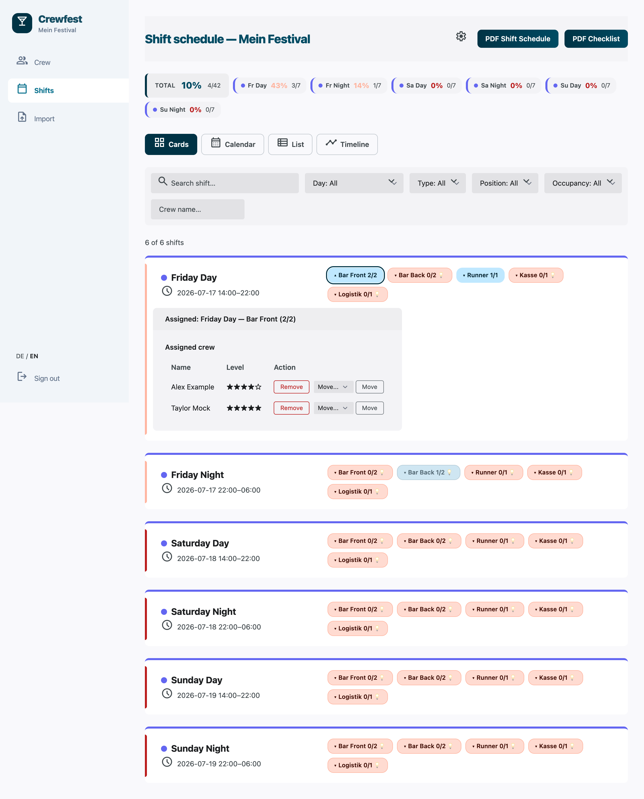
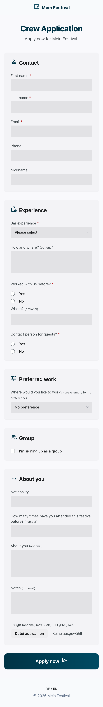
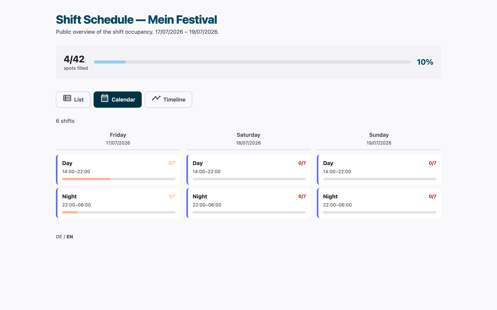

<p align="right"><a href="README.md">English</a> · <a href="README.de.md"><strong>Deutsch</strong></a></p>

# Crewfest

**Die leichtgewichtige Alternative für die Schichtplanung deiner Festival-Crew.**

Crewfest ist ein kleines, selbst gehostetes Tool, das eine Festival-Crew von der Bewerbung bis zum Check-in begleitet: ein öffentliches Bewerbungsformular, ein Admin-Dashboard zum Sichten und Vorauswählen, eine Schichtplanung mit Kapazitäten und Auto-Vorschlägen sowie PDF-/CSV-Exporte fürs Team vor Ort. Eine einzige SQLite-Datei, keine Cloud, kein Account nötig, um sich zu bewerben.

<table>
<tr>
<td width="33%"></td>
<td width="33%"></td>
<td width="33%"></td>
</tr>
<tr>
<td>Admin-Schichtplan — Kapazitäten, Zuweisungen, Level-Warnungen</td>
<td>Öffentliches Bewerbungsformular — mobile-first, ohne Account</td>
<td>Öffentlicher Schichtplan — Listen-, Kalender- oder Zeitstrahl-Ansicht</td>
</tr>
</table>

Weitere Screenshots (Admin-Dashboard, Einstellungen/Branding) liegen unter [`docs/screenshots/`](docs/screenshots/). Die Screenshots sind auf Englisch — die Oberfläche selbst ist vollständig zweisprachig.

## Was ist Crewfest / für wen ist es gedacht

Crewfest deckt den kompletten Lebenszyklus einer freiwilligen Crew für eine einzelne Veranstaltung ab: Bewerber:innen bewerben sich über ein öffentliches Formular, ein Admin sichtet und bewertet sie, weist sie Schichten und Positionen mit Kapazitätsgrenzen zu und erzeugt am Ende PDF-/CSV-Exporte für Einlass, Bar und Check-in-Tisch.

Gebaut ist es für Crews von etwa **20 bis 100 Personen** — eine Bar-Crew, eine Bühnen-Crew, das Freiwilligen-Team eines kleineren Festivals oder einer Konferenz. Wer bereits mit [Engelsystem](https://github.com/engelsystem/engelsystem) arbeitet (oder das erwägt) — dem Schichtplanungssystem, das für die großen Chaos-Computer-Club-Veranstaltungen gebaut wurde und dort seit Jahren im Einsatz ist —, hat damit ein wirklich gutes, ausgereiftes und aktiv weiterentwickeltes Werkzeug an der Hand, und für Congress-Größenordnungen mit hunderten Schichten und Engel-Typen ist es sehr wahrscheinlich die bessere Wahl. Crewfest ist für die Crews darunter gedacht, wo die Tiefe (und der Aufwand) von Engelsystem mehr ist, als man braucht, und eine einzige SQLite-Datei, die man von vorne bis hinten versteht, mehr wert ist als ein Feature, das man nie anfasst.

Kein Cloud-Account, kein SaaS-Abo, keine Daten, die den eigenen Server verlassen. Wer einen Docker-Container starten kann, kann Crewfest betreiben.

## Entstehungsgeschichte

*Dieses Projekt steht in keiner Verbindung zu Kulturkosmos e.V. oder dem Fusion Festival und wird von diesen weder unterstützt noch befürwortet.*

*Crewfest ist 2026 für eine Bar-Crew von rund 100 Freiwilligen entstanden, unter anderem im Einsatz beim Fusion Festival, und lief dort ein komplettes Festival lang im echten Betrieb — echte Bewerbungen, echte Schichtzuweisungen, echte PDF-Checklisten an der Bar. Daher kommt auch der Funktionsumfang: geformt von dem, was eine Crew dieser Größe tatsächlich gebraucht hat, und nichts, was sie nicht gebraucht hat.*

## Features

- Öffentliches Bewerbungsformular, kein Account nötig, mobile-first
- Selbsteinschätzung der Erfahrung (Level 1–5), automatisch aus einem kurzen Fragebogen abgeleitet
- Admin-Dashboard zum Sichten von Bewerbungen, Level-Vergabe und Status-Flow: `Beworben → Vorauswahl → Schicht-Auswahl → Bestätigt → Absage`
- Schicht- und Positionsverwaltung mit Kapazitäten je Position
- Zuweisungs-Werkzeuge: Einzelzuweisung, Gruppenzuweisung und automatische Kandidaten-Vorschläge für offene Slots
- Schichtplan-Ansichten: Karten (mit dem Zuweisungs-Flow), Kalender, Liste und Zeitstrahl
- Öffentlicher, rein lesender Schichtplan (nur Besetzungsstand, keine Crew-Namen)
- PDF-Exporte: vollständiger Schichtplan, kompakte Auswahl-Druckansicht und Check-in-/Check-out-Checklisten
- CSV-Import aus Google-Forms-Exporten sowie CSV-Exporte (Crew-Liste, externe Registrierungsliste)
- Durchgängig zweisprachig (Deutsch/Englisch) — Instanz-Standard plus `?lang=`-Override pro Besucher:in
- Konfigurierbares Branding: Veranstaltungsname, Organisation, Kontakt-E-Mail
- Läuft komplett offline — keine externen CDNs, Schriften und Icons sind gebündelt
- Crew-Ansicht mit geteiltem Passwort für einen rein lesenden Blick auf die Schichtbelegung, ohne Admin-Zugriff

## Schnellstart (Docker)

```bash
git clone https://github.com/arengia/crewfest.git
cd crewfest
docker compose up
```

Dann **http://localhost:3001/setup** öffnen, um das erste Admin-Konto anzulegen.

Bevor es über einen schnellen lokalen Test hinausgeht: einen echten `SESSION_SECRET` setzen — erzeugen mit:

```bash
openssl rand -hex 32
```

In eine `.env`-Datei neben `docker-compose.yml` eintragen (als Ausgangspunkt `.env.example` kopieren) oder vor `docker compose up` exportieren. Ohne gesetzten `SESSION_SECRET` startet die App im Produktivmodus gar nicht erst.

Wer über reines HTTP ohne TLS-terminierenden Reverse-Proxy ausliefert (z. B. `http://dein-host:3001` im LAN), sollte zusätzlich `COOKIE_SECURE=false` setzen — sonst verwirft der Browser das Login-Cookie und man landet in einer Login-Schleife. `docker-compose.yml` enthält dafür eine auskommentierte `COOKIE_SECURE: "false"`-Zeile — standardmäßig aus (der sichere Default ist die richtige Wahl, solange man nicht bewusst auf reinem HTTP ausliefert), bei Bedarf selbst einkommentieren.

## Alternative: direkt mit Node.js

```bash
npm ci
npm run build
npm start
```

Dafür wird Node.js ≥ 20 gebraucht sowie ein System-Chromium/Chrome für die PDF-Exporte (siehe `CHROMIUM_PATH` unten — das Docker-Image installiert das automatisch; außerhalb von Docker muss man selbst eins bereitstellen). `.env.example` nach `.env` kopieren und mindestens `SESSION_SECRET` ausfüllen.

Für einen dauerhaften Betrieb außerhalb von Docker ist ein Process-Manager wie [pm2](https://pm2.keymetrics.io/) eine sinnvolle Wahl, um Crewfest laufen zu halten und nach Abstürzen oder einem Neustart automatisch wieder hochzufahren:

```bash
npm install -g pm2
pm2 start dist/index.js --name crewfest
pm2 save
```

## Konfiguration

Die gesamte Konfiguration läuft über Umgebungsvariablen (siehe `.env.example`).

| Variable | Standard | Zweck |
|---|---|---|
| `PORT` | `3001` | HTTP-Port, auf dem die App lauscht |
| `NODE_ENV` | `development` | Für einen echten Betrieb auf `production` setzen — aktiviert die Sicherheitschecks beim Start (siehe unten) |
| `SESSION_SECRET` | — | **Pflicht im Produktivbetrieb.** Langer Zufallsstring zum Signieren der Session-Cookies. Erzeugen mit `openssl rand -hex 32`. Die App startet im Produktivmodus nicht, wenn dieser Wert fehlt oder noch auf dem Platzhalter steht |
| `DB_PATH` | `./data/crewfest.db` | Pfad zur SQLite-Datenbankdatei |
| `UPLOADS_DIR` | `var/uploads` | Verzeichnis für hochgeladene Bewerbungsfotos — liegt außerhalb von `public/`, wird nie statisch ausgeliefert, sondern nur über eine admin-authentifizierte Route |
| `COOKIE_SECURE` | `true` im Produktivbetrieb, sonst `false` | Cookie-„Secure"-Flag. Auf `false` setzen, wenn über reines HTTP ohne TLS-terminierenden Proxy ausgeliefert wird (z. B. Docker auf `http://host:3001`) — sonst wird das Login-Cookie verworfen und man landet in einer Login-Schleife |
| `CREW_PASSWORD` | nicht gesetzt | Geteiltes Passwort für die rein lesende `/crew`-Belegungsseite. Nicht gesetzt lassen, um diese Seite komplett geschlossen zu halten |
| `ADMIN_USERNAME` / `ADMIN_PASSWORD` | nicht gesetzt | Legt beim Start das Admin-Konto an, falls es noch nicht existiert, oder **setzt sein Passwort zurück**, falls doch. Praktisch für die Ersteinrichtung oder um ein vergessenes Passwort zurückzusetzen — beide nach der Einrichtung wieder entfernen, damit nicht bei jedem Neustart versehentlich zurückgesetzt wird |
| `CHROMIUM_PATH` | nicht gesetzt (Puppeteers eigenes Chromium) | Pfad zu einem System-Chromium/Chrome, genutzt für die PDF-Erzeugung. Das Docker-Image setzt dies automatisch auf das installierte Chromium; nur relevant, wenn außerhalb von Docker ein vorhandener System-Browser statt des von Puppeteer mitgebrachten genutzt werden soll |

## Sprachunterstützung

Crewfest ist durchgängig zweisprachig (Deutsch/Englisch) — Bewerbungsformular, Admin-Oberfläche, PDF-Exporte und CSV-Header. Die aktive Sprache wird in dieser Reihenfolge aufgelöst: ein expliziter `?lang=de`- oder `?lang=en`-Query-Parameter (setzt zugleich ein einjähriges Cookie) → dieses Cookie → die in **Einstellungen → Branding** konfigurierte Standardsprache der Instanz → Deutsch. Ein kleiner DE/EN-Umschalter sitzt im Footer jeder öffentlichen Seite sowie in der Admin-Sidebar.

## Datenschutz (DSGVO)

Crewfest ist selbst gehostet: **Betreiber:in der jeweiligen Instanz ist die verantwortliche Stelle** im Sinne der DSGVO, nicht wir. Das Bewerbungsformular erfasst personenbezogene Daten — Name, E-Mail, optional Telefonnummer und ein Foto — und der Admin-Bereich speichert sie, bis sie aktiv gelöscht werden.

Ein paar Dinge, die sinnvoll sind, sobald echte Bewerberdaten verarbeitet werden:

- Einen TLS-terminierenden Reverse-Proxy davorschalten (siehe `COOKIE_SECURE` oben) — Bewerberdaten, inklusive Fotos, sollten nie im Klartext übers Netz gehen.
- Crew-Daten nach der Veranstaltung löschen, sobald sie nicht mehr gebraucht werden. Das passiert nicht automatisch — eine frische SQLite-Datei pro Veranstaltung (oder ein bewusster Aufräum-Durchgang) ist ein sinnvolles Muster, wenn mehrere Events betrieben werden.
- Den Admin-Zugang beschränken — wer sich als Admin einloggen kann, sieht die Kontaktdaten, das Foto und die Freitext-Antworten jeder bewerbenden Person.

## Sicherheit

Siehe [SECURITY.md](SECURITY.md) für den Meldeweg bei Sicherheitslücken, unterstützte Versionen und eine Liste bekannter, bewusster Einschränkungen (Rate-Limiting, das geteilte Crew-Passwort und wie die PDF-Erzeugung abgesichert ist).

## Roadmap / Ideen

Keine Versprechen, nur Dinge, die bei Interesse sinnvoll erscheinen:

- Verwaltung mehrerer Admin-Konten (aktuell ein einziges, geteiltes Admin-Konto)
- Weitere Sprachen über Deutsch/Englisch hinaus
- Konfigurierbare Felder im Bewerbungsformular, statt des aktuell festen Satzes

## Mitwirken

Issues und PRs sind willkommen — siehe [CONTRIBUTING.md](CONTRIBUTING.md) für Dev-Setup, den Smoke-Test und die Commit-Konvention.

## Pflege

Crewfest wird auf Best-Effort-Basis von einem Festival-Orga mit Brotjob gepflegt, nicht von einer Firma mit SLA. Es gibt keine Support-Garantien und keine feste Reaktionszeit — Issues und PRs werden angeschaut, wenn Zeit ist.

## Lizenz

[MIT](LICENSE) © 2026 Adrien Renauldon
